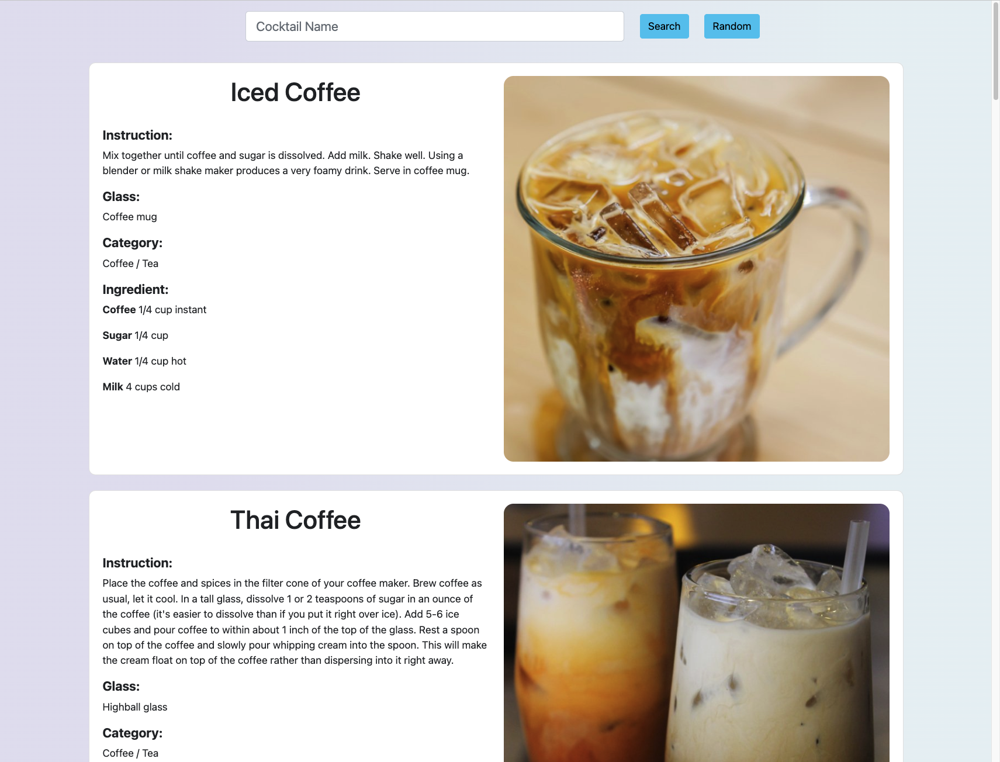

# DrinkAppDB

## Table of contents

* [General info](#general-info)
* [Technologies](#technologies)
* [Setup](#setup)
* [Features](#features)
* [Status](#status)

## General info

DrinkAppDB is an application with which you can find interesting recipes for alcoholic drinks. By entering the name of
the drink, a list with a photo and a recipe will be displayed.
This project uses data from "TheCocktailDB" - https://www.thecocktaildb.com/

## Technologies

* Python version 3.6 ( Using library 'requests' )
* Django version 3.2
* Bootstrap version 5.0

## Setup

```
# 1. To run this project, create a virtual environment and clone the repository.
$ https://github.com/Trzups/DrinkAppDB.git

# 2. Activate the virtual environment
$ source virtenv/bin/activate

# 3. Then go to the folder :
$ AppDrinkDB

# 4. Using:
$ pip install -r requirements.txt

# 5. And start project:
$ python manage.py runserver
```

A page should appear where you will be prompted to enter the name of the drink you are looking for.


After typing an interesting drink



